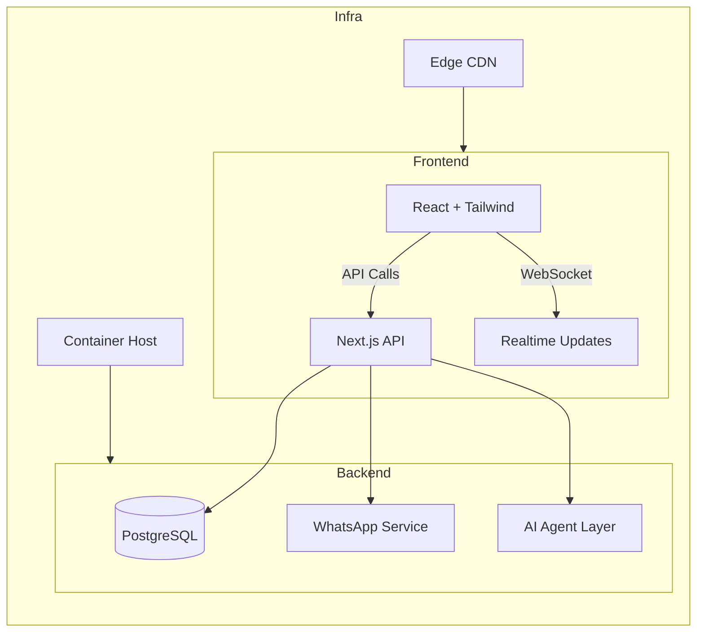

# 📦 Prime Apparel B2B ERP

)
)
)


---

## ✨ Premium Project Introduction
**Prime Apparel B2B ERP** is a world‑class, AI‑powered B2B commerce platform for premium fashion wholesalers. It delivers an **app‑like, mobile‑first experience** to buyers while providing a powerful admin suite for inventory, orders, finance, and lead management.

The platform mirrors the polish of top‑tier SaaS products (Linear, Stripe, Apple) and the elegance of high‑end D2C fashion brands.

---

## 🚀 Hero Title
<div align="center">
  <h1 style="font-family: 'Outfit', sans-serif; font-weight: 900; font-size: 3rem; color: #d4af37;">India's Smartest Sourcing Hub</h1>
  <p style="font-size: 1.25rem; color: #e5e7eb;">Premium Kurtis & Suit Sets – Direct from Surat Mills, Verified by Mumbai QC.</p>
</div>

---

## 🌟 Features Overview
| ✅ Feature | 📝 Description |
|------------|----------------|
| **Premium UI** | Glass‑morphism panels, subtle shadows, micro‑animations, skeleton loaders. |
| **Mobile‑First Navigation** | Sticky bottom NavBar with `framer‑motion` slide‑up animation. |
| **Product Catalog** | Responsive grid, lazy‑loaded high‑resolution images, infinite scroll/pagination. |
| **Product Detail Modal** | Full‑screen slide‑up, image carousel, size/color selectors. |
| **Enquiry Cart** | WhatsApp‑prefilled message, auto‑generated LR (Lorry Receipt) tracking. |
| **Buyer Registration** | Multi‑step wizard, real‑time validation, lead scoring (0‑100). |
| **Admin Dashboard** | KPI cards, recent activity feed, stock & order management. |
| **WhatsApp Workflow** | One‑click enquiry → WhatsApp, automated receipt & status updates. |
| **AI Browser Automation** | Puppeteer tests capture before/after screenshots, visual regression. |
| **Scalable Architecture** | PostgreSQL, Vercel edge‑caching, Cloudinary CDN for media. |

---

## 📸 Screenshots
> *All screenshots are stored in `docs/screenshots/` and rendered below.*

| Home (Desktop) | Home (Mobile) |
|---|---|
|  |  |
| **Catalog** | **Product Modal** |
|  |  |

---

## 🛠️ Tech Stack
- **Framework:** Next.js 14 (App Router) – React 18, TypeScript
- **Styling:** Tailwind CSS 3, custom design system (glass‑panel, animations)
- **Animations:** framer‑motion
- **Database:** Prisma ORM → SQLite (dev) → PostgreSQL (prod)
- **Auth:** JWT (staff), session‑less buyer flow
- **Automation:** Puppeteer (browser QA)
- **CI/CD:** Vercel (or Docker + Kubernetes)
- **Media CDN:** Cloudinary (future) / static `public/`

---

## 📁 Folder Structure
```
prime-apparel-b2b-erp/
│
├─ src/
│   ├─ app/                 # Next.js routes & layouts
│   │   ├─ admin/           # Admin UI (orders, stock, buyers …)
│   │   ├─ catalog/         # Buyer catalog page
│   │   ├─ login/ register/ # Auth flows
│   │   └─ page.tsx         # Home page (buyer facing)
│   ├─ components/          # Re‑usable UI (NavBar, Card, Modal, …)
│   └─ lib/                 # Prisma client, auth helpers
│
├─ public/                  # Static assets (logo, favicons)
├─ tests/                    # Puppeteer test suite + screenshots
├─ prisma/                   # Prisma schema & migrations
├─ .gitignore
├─ package.json
├─ tailwind.config.js
└─ README.md
```

---

## 👤 Buyer Workflow
1. **Landing** – Hero section with CTA **Register B2B Account**.
2. **Registration Wizard** – Email → Business details → GST verification → Lead scoring.
3. **Catalog Browsing** – Premium product cards, filter bar, infinite scroll.
4. **Product Detail** – Modal with carousel, size/color picker, **Enquire** button.
5. **Enquiry Cart** – Review selections, auto‑generate WhatsApp message with product SKUs, quantities, and a unique LR code.
6. **WhatsApp Confirmation** – Sales team replies with payment terms; buyer receives invoice link.
7. **Order Tracking** – Real‑time status updates via WhatsApp and dashboard KPI cards.

---

## 🛠️ Admin Workflow
1. **Login** – Staff JWT auth.
2. **Dashboard Overview** – KPI cards (sales today, low stock, pending payments).
3. **Stock Management** – View/adjust `qty_available`, `qty_reserved`, low‑stock alerts.
4. **Orders** – Review enquiries, confirm dispatch, generate LR, update payment status.
5. **Buyers & Leads** – View buyer profiles, lead scores, convert leads to verified buyers.
6. **Cash‑Flow** – Invoice ledger, overdue collections, export reports.

---

## 📱 WhatsApp Workflow
- **One‑click Enquire** builds a pre‑filled message:
  ```
  Hi Prime Apparel,
  I’d like to order:
  • SKU: PA‑25‑KR‑001 – Qty: 12 pcs
  • SKU: PA‑25‑SS‑001 – Qty: 8 pcs
  Please share LR and payment details.
  ```
- Sales team replies with **Lorry Receipt (LR) number** and a **payment link**.
- Automated webhook (future) will update order status in the system.

---

## 📦 Inventory Workflow
- **Ingest** – New SKUs added via admin UI (CSV import option planned).
- **Stock Allocation** – `available = total - low_stock - out_of_stock`.
- **Low‑Stock Alerts** – Dashboard badge turns **amber** when < 10 pcs, **red** when 0.
- **Reservation** – When a buyer adds a SKU to the cart, `qty_reserved` increments to prevent oversell.
- **Reconciliation** – Daily batch job (cron) syncs `qty_available` with actual warehouse counts.

---

## 🧾 Order Workflow
| Step | Action |
|------|--------|
| 1️⃣  | Buyer creates enquiry (cart) → WhatsApp message |
| 2️⃣  | Sales verifies stock, generates LR, sends payment link |
| 3️⃣  | Buyer pays (offline or via integrated gateway – future) |
| 4️⃣  | Staff marks order as **Dispatched** → updates `order_status` |
| 5️⃣  | Real‑time LR tracking shared back to buyer via WhatsApp |
| 6️⃣  | Order marked **Delivered** – invoice archived |

---

## 🌐 API Overview
*All routes are **force‑dynamic** to guarantee fresh data.*

| Method | Endpoint | Description |
|--------|----------|-------------|
| `POST` | `/api/auth/login` | Staff JWT authentication |
| `POST` | `/api/auth/register` | Buyer registration wizard |
| `GET`  | `/api/products` | Public catalog (filters, pagination) |
| `GET`  | `/api/products/:sku` | Single product details |
| `POST` | `/api/orders` | Create enquiry → WhatsApp workflow |
| `GET`  | `/api/orders/:id` | Order status & LR info |
| `PATCH`| `/api/stock/:sku` | Adjust reserved / available quantities |
| `POST` | `/api/lead` | Submit lead data → scoring |

Full OpenAPI spec lives in `API.md`.

---

## 🗄️ Database Architecture
The schema is defined in `prisma/schema.prisma`.

```prisma
model User {
  id        Int      @id @default(autoincrement())
  email     String   @unique
  role      Role
  password  String
  createdAt DateTime @default(now())
}

enum Role { BUYER STAFF }

model Buyer {
  id          Int      @id @default(autoincrement())
  businessName String
  city        String
  leadScore   Int      @default(0)
  verified    Boolean  @default(false)
  orders      Order[]
}

model Product {
  sku_id          String   @id
  design_name     String
  fabric          String
  price           Decimal
  qty_available   Int
  qty_reserved    Int
  photo_urls      Json
  status          String
}

model Order {
  id            Int      @id @default(autoincrement())
  buyerId       Int
  buyer         Buyer    @relation(fields: [buyerId], references: [id])
  items         OrderItem[]
  payment_status String   @default("pending")
  order_status   String   @default("confirmed")
  created_at     DateTime @default(now())
}

model OrderItem {
  id        Int   @id @default(autoincrement())
  orderId   Int
  productId String
  qty       Int
  price     Decimal
}
```

---

## ⚙️ Setup Instructions
```bash
# Clone (already done) and move to project root
cd prime-apparel-b2b-erp

# Install dependencies (exact versions via lockfile)
npm ci

# Prisma: generate client & run migrations (SQLite dev DB)
npx prisma generate
npx prisma migrate dev --name init   # creates dev.db

# Start dev server
npm run dev   # http://localhost:3000
```

Make sure you have a `.env` file with:
```dotenv
DATABASE_URL="file:./dev.db"
JWT_SECRET="#YOUR_SECRET#"
NEXT_PUBLIC_WHATSAPP_NUMBER="+919999999999"
```

---

## 🖥️ Local Development Guide
| Task | Command |
|------|---------|
| Run app | `npm run dev` |
| Lint | `npm run lint` |
| Format | `npm run format` |
| Browser QA (Puppeteer) | `npm run test:browser` |
| Lighthouse report | `npm run lighthouse` |

### VS Code recommended extensions
- **Tailwind CSS IntelliSense**
- **ESLint**
- **Prettier**
- **Prisma**

---

## 🚢 Deployment Guide
### Vercel (one‑click)
1. Connect the GitHub repo to Vercel.
2. Add environment variables (same as `.env`).
3. Enable **PostgreSQL** add‑on (Vercel‑Postgres). Vercel will run `npm ci && npm run build` automatically.

### Docker (self‑hosted)
```dockerfile
FROM node:20-alpine AS builder
WORKDIR /app
COPY package*.json ./
RUN npm ci
COPY . .
RUN npm run build

FROM node:20-alpine
WORKDIR /app
COPY --from=builder /app/.next ./.next
COPY --from=builder /app/public ./public
COPY --from=builder /app/node_modules ./node_modules
COPY --from=builder /app/package*.json ./
EXPOSE 3000
CMD ["npm", "start"]
```
Deploy the image to any container platform (AWS ECS, GKE, Azure ACI).

---

## 📱 Mobile‑First Philosophy
- All components use **responsive Tailwind utilities** (`sm`, `md`, `lg`).
- Touch targets are **≥ 48 px**.
- Gesture‑driven UI: swipe‑up modals, drag‑to‑scroll carousels.
- Images are served via **progressive loading** (`blur‑up` → high‑res). 
- Font‑stack: `Inter` + `Outfit` for crisp legibility on mobile.

---

## 🔐 Security Notes
- **JWT** signed with `JWT_SECRET` (256‑bit HMAC). Tokens expire after 7 days.
- **Rate limiting** on auth endpoints (Next.js middleware). 
- **CORS** locked to the app’s domain.
- **Prisma** uses parameterised queries – no raw SQL. 
- All secrets stored **only in environment variables**; never committed.
- **HTTPS** enforced on Vercel/production domains.
- See `SECURITY.md` for responsible disclosure.

---

## 🤖 AI Browser Automation Testing
- **Puppeteer** scripts (`tests/automated-browser-test.js`) simulate a full buyer journey:
  1. Load homepage → take screenshot.
  2. Complete registration wizard → screenshot.
  3. Browse catalog (blurred prices) → screenshot.
  4. Login as buyer → unlocked catalog → screenshot.
- Results stored under `tests/screenshots/` and compared via visual regression.
- CI pipeline runs these tests on every push.

---

## 📈 Future Roadmap
| Quarter | Goal |
|---------|------|
| **Q2 2026** | Migrate fully to PostgreSQL, add Cloudinary CDN for media. |
| **Q3 2026** | AI‑agent integration for automated lead nurturing and order suggestions. |
| **Q4 2026** | Stripe payment integration, real‑time order tracking dashboard. |
| **2027** | Multi‑tenant SaaS version, international warehouses, multi‑currency pricing. |

Full roadmap in `ROADMAP.md`.

---

## 🖼️ Production Architecture Diagrams
> *(Diagrams are stored in `docs/architecture/` and rendered below via Mermaid.)*



---

## 🏆 Professional Badges
```


```

---

## 📚 Additional Documentation
- `ARCHITECTURE.md` – deeper dive into system components.
- `API.md` – full OpenAPI spec.
- `DEPLOYMENT.md` – Vercel & Docker deployment steps.
- `DATABASE.md` – Prisma schema walkthrough.
- `CONTRIBUTING.md` – how to submit PRs.
- `SECURITY.md` – vulnerability reporting.
- `ROADMAP.md` – long‑term vision.

---

*Built with ❤️ by the Prime Apparel team.*
