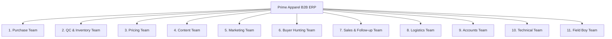

# PRIME APPAREL EXPORTS: BUSINESS & OPERATIONAL MODEL

This document outlines the core organizational architecture, department branch responsibilities, full connected operational workflow, and business objectives of the Prime Apparel B2B Garments ERP.

---

## 🏢 1. Company Branch Structure & Organization

The company is organized into **11 distinct operational branches**, each carrying specialized responsibilities to ensure speed, efficiency, and penny-perfect execution.



---

## 📋 2. Department Branch Responsibilities

### 1. Purchase Team
*   **Core Role:** Surat and manufacturing hubs se right product aur highest-quality designs ko sabse correct B2B wholesale rates par lane ka kaam.

### 2. QC & Inventory Team
*   **Core Role:** Stock receive karna, accurate piece counting, stock levels update karna, defect auditing, and complete warehouse control.

### 3. Pricing Team
*   **Core Role:** Purchase cost + transport freight + overhead allocations calculate karke accurate **Landed Cost** nikalna, aur optimal profit margins parameters par realistic **B2B Wholesale / Scheme Selling Prices** design karna.

### 4. Content Team
*   **Core Role:** Garments photoshoot, product videos, catalogue descriptions, aur digital website display assets prepare karna.

### 5. Marketing Team
*   **Core Role:** Social media promotions, bulk WhatsApp campaigns, alerts management, and B2B marketing funnel drives.

### 6. Buyer Hunting Team
*   **Core Role:** Naye B2B buyers find karna, unka GSTIN/PAN legal status verify/qualify karna, and hot/warm leads generation.

### 7. Sales & Follow-up Team
*   **Core Role:** Interested buyer leads ko warm follow-ups dena, catalogues share karna, chatbot enquiries handle karna, and orders close karna.

### 8. Logistics Team
*   **Core Role:** Orders dispatch checklist handle karna, secure packaging, AWB label printings, and Shiprocket parcel generation.

### 9. Accounts Team
*   **Core Role:** GST billing parameters audit, dynamic unpaid outstanding ledger calculations, buyer payment receivables entries, profit tracking, and overdue collections check.

### 10. Technical Team
*   **Core Role:** Website maintenance, database optimization, CRM integrations, automation engines, credit locks safety triggers, and automated webhooks dispatches.

### 11. Field Boy Team
*   **Core Role:** Physical sample distributions, in-person buyer visits, cash/payment collection runs, and field updates.

---

## 🔄 3. The Full Connected B2B Operational Flow

Every single garment follows a highly synchronized, sequential lifecycle enabled by our integrated ERP:

```
[ Product Research & Surat Sourcing ] (Purchase Team)
                 │
                 ▼
[ Physical Warehouse Stock Entry & Audits ] (Inventory Team)
                 │
                 ▼
[ Landed Cost & Wholesale Scheme Pricing Setup ] (Pricing Team)
                 │
                 ▼
[ Media Assets Photoshoot & cataloging ] (Content Team)
                 │
                 ▼
[ Web Listing & WhatsApp Marketing Blast ] (Marketing Team)
                 │
                 ▼
[ GST/PAN Buyer Onboarding & Lead Scoring ] (Buyer Hunting Team)
                 │
                 ▼
[ Chatbot & Sales Order Warm Follow-ups ] (Sales Team)
                 │
                 ▼
[ In-Person Sample Visits & Collection ] (Field Boy Team)
                 │
                 ▼
[ B2B/B2C Order Checkout & Credit checks ] (Technical Team)
                 │
                 ▼
[ Packing, AWB Booking & Shiprocket Dispatch ] (Logistics Team)
                 │
                 ▼
[ Delivery Webhook sync & POD Proof Attachments ] (Technical Team)
                 │
                 ▼
[ Payment Receivables Collection ] (Field Boy / Accounts Team)
                 │
                 ▼
[ Billing Audits, Ledger Cleansing & Net Profits ] (Accounts Team)
```

---

## 🏆 4. Core Business Outputs & Objectives
*   **Fast-Selling Products:** Sourcing data ensures only high-demand apparel is purchased.
*   **Clear Stock Control:** Real-time reserved and available piece tracking prevents double-allocation or depleted inventories.
*   **Correct Landed Pricing:** Accurate freight and margin metrics secure company net profit.
*   **Better Buyer Conversions:** Leads are qualified automatically via verified GSTIN/PAN and prioritized by Lead Scores.
*   **Less Dead Stock:** System connects live demand catalogs with real-time stock inputs.
*   **Better Cash Flow:** Automated Credit Control locks matured outstanding buyers, eliminating delayed payments.
*   **Repeat B2B Orders:** Automated WhatsApp dispatches, smooth Shiprocket tracking, and delivery POD proofs encourage loyal relationships.
*   **Scalable Company System:** Replaces ad-hoc operations with a unified B2B digital enterprise framework.

---

## 💡 5. Core Operational Mantra
> **"Sahi product lao, sahi rate pe lo, sahi price pe becho, aur right buyer tak sahi time pe pahunchao."**
