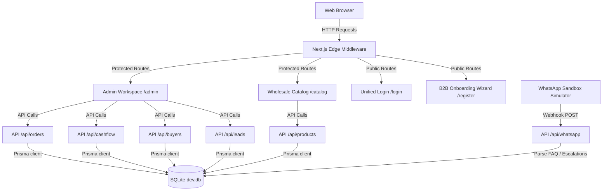
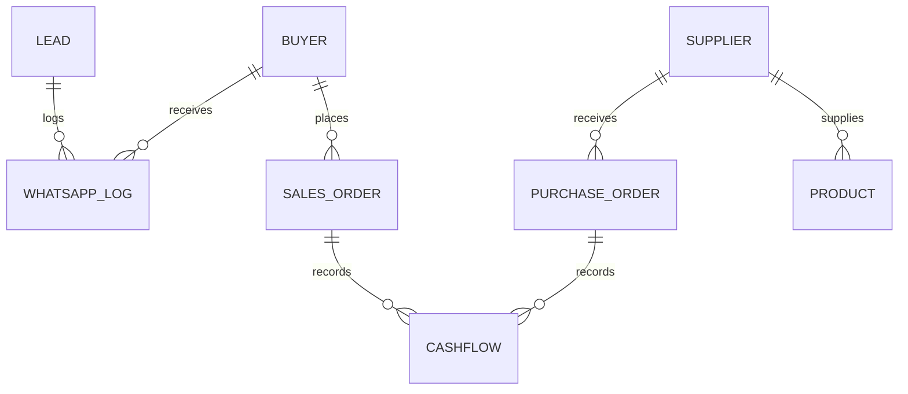
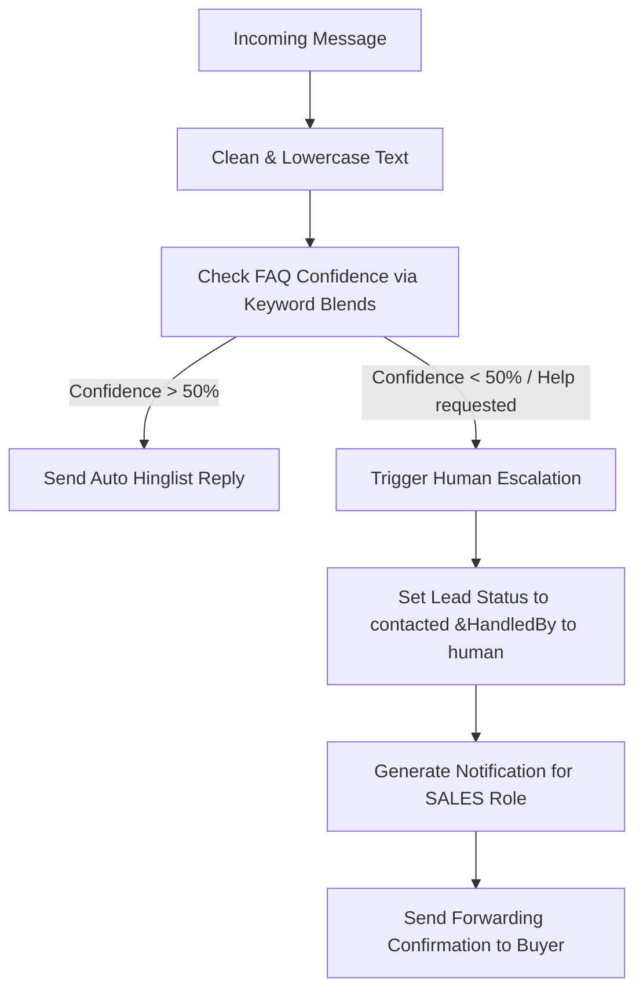

# Current Architecture: Prime Apparel B2B ERP

This document details the software architecture, database design, routing security model, and WhatsApp automation engine powering the Prime Apparel B2B ERP.

---

## 🏛 Software Architecture Overview

The system is built on a modern **Next.js (App Router)** stack featuring a **SQLite** database, **Prisma ORM**, and client-side page rendering leveraging Tailwind CSS and Framer Motion.

---

## 🔒 Route Authorization & Role Access Control

Authentication uses **JWT Token Authorization** stored in HTTP-Only cookies (`auth_token`). Next.js Edge Middleware (`src/middleware.ts`) runs on every routing cycle to securely protect paths.

### Middleware Decoding Flow
1. **Extraction:** Looks up cookie `auth_token`.
2. **Safe Edge Decoding:** Decodes the token’s base64 payload safely in the Edge Runtime (without external node crypto dependencies) using `atob()`.
3. **Role Checks:**
  * **Staff Routes (`/admin/*`):** Decoded role must belong to `["ADMIN", "FOUNDER", "SALES", "INVENTORY", "ACCOUNTS", "CONTENT"]`. If the role is `BUYER`, the user is immediately redirected to the buyer portal `/catalog`. If no token exists, the user is redirected to `/login`.
  * **Auth Routes (`/login`, `/register`):** Prevents logged-in users from accessing credentials wizards. Staff are redirected to `/admin`, and buyers are redirected to `/catalog`.

---

## 💾 Database Schema Design

The SQLite database (`prisma/schema.prisma`) holds **10 primary models** with robust relationships:

### Models Detail
1. **`Buyer`**: Stores WhatsApp mobile (primary identifier), passwords, shop name, dynamic qualification score (0-100), lead tier (HOT, WARM, COLD), credit limits, and purchase statistics.
2. **`Product`**: Sourcing SKU master (standard price, bulk pricing tiers, physical weight/lengths, and reserved vs available stock levels).
3. **`Supplier`**: Sourcing nodes (mainly Surat factories) rating specialities and written terms status.
4. **`SalesOrder`**: Confirmed customer sales, LR transport numbers, dispatch status, payment status (paid, overdue, pending), and B2B pricing totals.
5. **`PurchaseOrder`**: Wholesale manufacturing orders to Surat, tracking GRN and QC flags.
6. **`CashFlow`**: Ledger tracking revenues and operating expenses (salary, rent, freight, marketing).
7. **`Lead`**: CRM capture cards tracking temperature grades and onboarding acquisition logs.
8. **`Staff`**: System operators role-mapped to access tokens.
9. **`WhatsAppLog`**: Conversations historical transcripts.
10. **`Notification`**: Broadcast items for internal roles (e.g. low stock alerts, overdue invoices).

---

## 🤖 WhatsApp Chatbot FAQ & Escalation Flow

The WhatsApp simulation endpoint (`/api/whatsapp` calling `src/lib/whatsapp.ts`) runs a hybrid AI match router.

### Supported FAQ Keywords
* **MOQ:** "Minimum 12 pieces per design"
* **Fabrics:** "Cambric Cotton, Heavy Rayon, Georgette, Crape"
* **Shipping:** "Surat dispatch, 3-7 days via V-Trans/Logistics"
* **Return Policy:** "Damage/weaving defects exchange within 7 days with parcel opening video"
* **Address:** "Ring Road, Surat, Gujarat"
