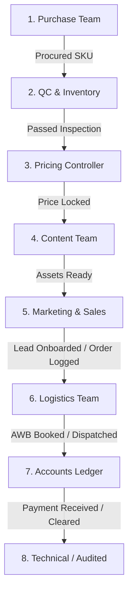

# PRIME APPAREL EXPORTS: Inter-Department Handoff Flows

This runbook describes the operational dependencies and automatic task handoff triggers that connect the 12 branches and departments of Prime Apparel Exports.

---

## 🔗 The Handoff Dependency Flow

To maintain high efficiency, departments do not operate in silos. The completion of a task in one department triggers an automated alert in the database and routes a notification to the inbox checklist of the succeeding department.

---

## ⚡ Automated Database Handoff Triggers

When a department updates an operational stage, the `workflow.ts` engine automatically generates targeted notifications:

### 1. Purchase Complete → QC & Inventory Notified
- **Operational Trigger**: Product status updated to `PURCHASE`.
- **System Action**: Generates a notification for `QC` and `INVENTORY` role:
  - *"Product SKU-ID purchased. Inventory team, prepare warehouse for Stock Entry."*

### 2. Stock Entry Complete → QC Inspection Triggered
- **Operational Trigger**: Product status updated to `STOCK_ENTRY`.
- **System Action**: Generates a notification for `QC` role:
  - *"Stock entered for SKU-ID. QC team, pending physical quality inspections."*

### 3. QC Passed → Pricing Team Notified
- **Operational Trigger**: Product status updated to `QC` (Complete).
- **System Action**: Generates a notification for `PRICING` role:
  - *"QC completed for product SKU-ID. Pricing team, pending landed cost and B2B pricing calculations."*

### 4. Pricing Complete → Content Creators Notified
- **Operational Trigger**: Product status updated to `PRICING` (Complete).
- **System Action**: Generates a notification for `CONTENT` role:
  - *"Pricing complete for SKU-ID. Content team, pending photoshoot and model catalog descriptions."*

### 5. Photoshoot Ready → Marketing & Sales Notified
- **Operational Trigger**: Product status updated to `PHOTOSHOOT` (Complete).
- **System Action**: Generates notifications for `MARKETING` and `SALES` roles:
  - *Marketing: "Photoshoot ready for SKU-ID. Marketing team, prepare social listing campaigns."*
  - *Sales: "New catalog stock ready: SKU-ID. Sales team, initiate warm B2B outreach."*

### 6. Order Confirmed & QC Checked → Logistics Booking Triggered
- **Operational Trigger**: Order status updated to `qc_ok`.
- **System Action**: Generates a notification for `LOGISTICS` role:
  - *"Order Order-ID cleared QC. Logistics, proceed with packing and shipment routing."*

### 7. Cargo Dispatched → Accounts Ledger Triggered
- **Operational Trigger**: Order status updated to `dispatched`.
- **System Action**: Generates a notification for `ACCOUNTS` role:
  - *"Order Order-ID has been dispatched. Accounts, verify pending balance payments and credit limits."*
