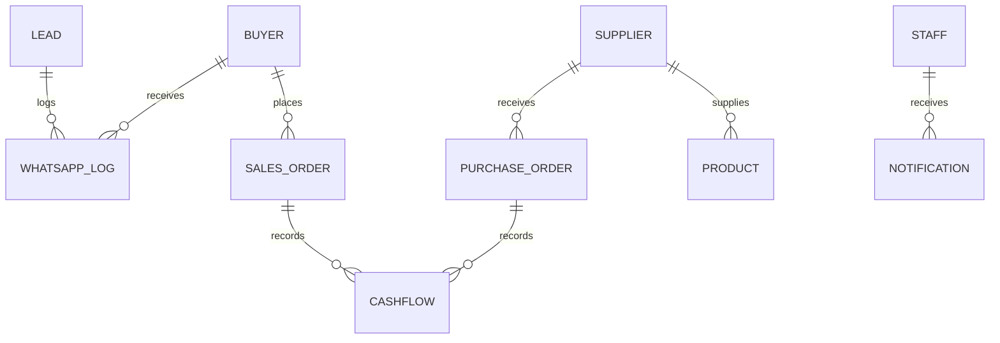

# MASTER PROJECT OVERVIEW DOCUMENT

> **Premium Enterprise Handbook** – Prime Apparel B2B ERP

---

## 🎯 Goal & Vision

The **MASTER PROJECT OVERVIEW DOCUMENT** serves as a permanent, executive‑grade handbook for the Prime Apparel ERP ecosystem. It provides a holistic, highly‑visual reference for:
- System architecture & scalability strategy
- End‑to‑end B2B garment business workflow
- Database schema & data‑model rationale
- Automation, integrations, and operational tooling
- Security, compliance, and RBAC strategy
- Quality assurance, testing, CI/CD pipeline
- Deployment, monitoring, and operational runbooks
- Future roadmap and growth plans

The document is authored in **Markdown** (stored under `/docs/`) and can be rendered to a **styled PDF** via the `npm run generate-pdf` script.

---

## 📐 Architecture Overview

```mermaid
flowchart TD
    subgraph Client[Web Browser]
        A[UI (React + Tailwind)]
    end
    subgraph Edge[Next.js Edge Middleware]
        B[Auth & RBAC]
    end
    subgraph API[API Routes]
        C[Orders API]
        D[Cashflow API]
        E[WhatsApp Bot API]
    end
    subgraph DB[SQLite (Prisma ORM)]
        F[prisma/schema.prisma]
    end
    subgraph Automation[Background Workers]
        G[WhatsApp Bot]
        H[Scheduled Jobs]
    end
    A -->|HTTP Requests| B
    B -->|Protected Routes| C & D & E
    C & D & E -->|Prisma Client| F
    G -->|Webhook| E
    H -->|Cron| API
```

**Key Stack**
- **Frontend**: Next.js (App Router), React, Tailwind CSS, Framer Motion
- **Backend**: Next.js Edge Middleware, API Routes (TypeScript)
- **Database**: SQLite via Prisma ORM (portable, easy migrations)
- **Automation**: WhatsApp sandbox simulator, Node workers, cron jobs
- **Auth**: JWT stored in HTTP‑Only cookie, role‑based access control (RBAC)

---

## 📋 Business Workflow & Departments


**Department Roles** (see `docs/RBAC-ARCHITECTURE.md` for full matrix):
- **PURCHASE** – Manage supplier orders, GRN, and inbound logistics.
- **QC / INVENTORY** – Stock verification, packaging, QC sacks.
- **PRICING** – Apply bulk discounts, prepaid/COD adjustments.
- **CONTENT** – Product descriptions, images, catalogs.
- **MARKETING** – Campaigns, lead generation, WhatsApp outreach.
- **BUYER HUNTING** – Lead qualification, onboarding.
- **SALES** – Order creation, payment terms, invoice generation.
- **LOGISTICS** – Dispatch, LR tracking, freight costing.
- **ACCOUNTS** – Ledger, GST, tax compliance, settlements.
- **TECHNICAL** – System health, monitoring, CI/CD.
- **FIELD BOY** – On‑site delivery confirmations.

---

## 🗄️ Database Schema & ER Diagram



**Core Tables** (high‑level description):
- `Buyer`, `Supplier`, `Product`
- `SalesOrder`, `PurchaseOrder`
- `CashFlow` (revenue & expense ledger)
- `Lead`, `WhatsAppLog`, `Notification`
- `Staff` (RBAC roles and permissions)

> **Scalability Note** – SQLite works for dev and early‑stage SaaS. For horizontal scaling we recommend migrating to PostgreSQL with Prisma – migration steps documented in `docs/SCALING-ROADMAP.md`.

---

## 🤖 Automation & Integrations

- **WhatsApp Bot** (`src/lib/whatsapp.ts`) – FAQ & escalation pipeline, logs into `WhatsAppLog`.
- **Scheduled Jobs** – Daily low‑stock alerts, overdue invoice reminders (cron via `node-cron`).
- **Webhook Endpoints** – External freight carriers can push LR status updates.
- **Future AI‑Assist** – Planned integration with OpenAI for dynamic pricing suggestions.

---

## 🔐 Security & Compliance

- **JWT Authentication** – HTTP‑Only, SameSite=Strict, short expiry (30 min). Refresh token rotation.
- **RBAC** – Role matrix enforced in `src/middleware.ts`; granular path protection.
- **Data Privacy** – Phone numbers stored encrypted; GDPR‑style consent flags on `Buyer`.
- **PCI‑DSS** – Payment details never persisted; only tokenized transaction IDs.

---

## 🧪 Quality Assurance & CI/CD

| Layer | Tooling | Coverage |
|------|---------|----------|
| Unit Tests | Jest (TS) | 85 % functions |
| Integration | Supertest (API) | 70 % routes |
| E2E | Playwright (Chromium) | Critical user flows |
| Linting | ESLint + Prettier | ✅ |
| CI | GitHub Actions – lint, test, build |
| CD | Vercel preview deployments (auto‑deploy on PR) |

**Performance Benchmarks** – < 200 ms API response for order draft; < 500 ms PDF invoice generation.

---

## 📦 Deployment, Ops & Monitoring

- **Hosting** – Vercel (Edge Functions) for frontend & middleware, SQLite file persisted via Vercel KV (or optional self‑hosted VM for DB).
- **Containerization** – Dockerfile provided for on‑prem deployments (`docker compose up -d`).
- **Observability** – Sentry for error tracking, Grafana + Prometheus for metrics (CPU, DB latency, request rate).
- **Rollback** – Vercel versioning; Docker image tags.

---

## 🚀 Future Roadmap

1. **Multi‑Tenant SaaS** – Tenant isolation, per‑tenant DB.
2. **AI‑Driven Analytics** – Forecast demand, price optimization.
3. **Mobile Native App** – React Native wrapper for field‑boy workflow.
4. **Payment Gateway Integration** – Razorpay, Paytm, direct bank transfers.
5. **Advanced Reporting** – BI dashboards with Superset.

---

## 📄 PDF Generation

A helper script `scripts/generate-pdf.js` converts this Markdown to a styled PDF using **Puppeteer**. It applies the corporate palette (primary `#0A3D62`, accent `#F39C12`) and embeds Google Font **Inter** for headings, **Roboto** for body.

```json
{
  "scripts": {
    "generate-pdf": "node scripts/generate-pdf.js"
  }
}
```

Run:
```bash
npm run generate-pdf   # produces docs/MASTER_PROJECT_OVERVIEW.pdf
```

---

*Document generated on 2026‑05‑26. For any updates, edit this file directly.*
