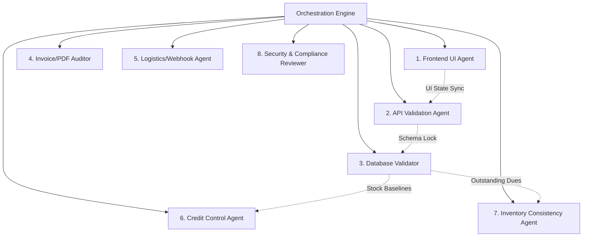

# PRIME APPAREL B2B ERP: MULTI-AGENT PARALLEL QA TESTING STANDARD

This document defines the persistent execution strategy and operational guidelines for AI coding agents and human QA developers running verification sequences against the B2B ERP + E-commerce system.

---

## ⚡ Execution Philosophy: Parallel Specialist Orchestration

To maintain speed, determinism, and 100% compliance across all ERP layers, all testing, validation, and verification tasks must default to **Multi-Agent Parallel Execution**.

Rather than running a monolithic sequence, the testing scope is divided among **8 isolated, parallel specialist agents/workers**, synchronizing only when schema or shared state dependencies are required.

---

## 👥 Division of Labor: Specialist Agent Roles

### 1. Frontend UI Agent
*   **Domain:** User flows, interactive states, look-and-feel.
*   **Responsibilities:**
    *   Test onboarding registration wizards (`/register`), toggles, location selections.
    *   Verify admin buyers approvals and settings (`/admin/buyers`).
    *   Verify lookbook catalog visibility pricing blur locks for guest sessions, and unlocks upon approved logins (`/catalog`).
    *   Assert checkout legal policy terms agreement checkbook overlays and blockers.
    *   Test manual order log widgets inside the admin order workbench (`/admin/orders`).
*   **Constraint:** Must run in **visible browser agent mode** to capture high-fidelity UI snapshots and store step-by-step verification flows.

### 2. API Validation Agent
*   **Domain:** HTTP routes, JSON structures, schema inputs, and status codes.
*   **Responsibilities:**
    *   Validate format verification routes (GST verify format checks, PAN/Aadhaar syntax).
    *   Assert standard validation HTTP status codes (e.g. `200` OK, `403` Forbidden for validation failure, `400` Bad Request, etc.).
    *   Verify dynamic payload structures for CRUD actions under `/api/orders`, `/api/buyers`, and webhook responders.

### 3. Database Validation Agent
*   **Domain:** Database tables, referential integrity, indexes, and constraints.
*   **Responsibilities:**
    *   Enforce foreign-key constraints (e.g. cascading deletes on relational WhatsApp logs and Sales Orders during sanitization).
    *   Audit database indexes, schema migrations correctness, and transaction locks.
    *   Establish pristine database clean slates during setup phases.

### 4. Invoice/PDF Validation Agent
*   **Domain:** Accounting layouts, tax computations, and regulatory footers.
*   **Responsibilities:**
    *   Verify B2B Tax Invoices dynamically display GSTIN details and split taxes pro-ratably (e.g., intra-state CGST + SGST vs inter-state IGST splits).
    *   Verify B2C Unregistered Invoices display masked PAN/Aadhaar values to secure customer data.
    *   Audit legal footers: Mumbai jurisdiction, standard payment deadlines, compound interest warnings under the MSME Act, and unedited raw parcel opening video guidelines.
    *   Validate offset invoice due date parameters (`due_date = order_date + buyer.credit_days`).

### 5. Shiprocket/Webhook Testing Agent
*   **Domain:** Courier booking integrations, simulated status endpoints, and tracking listeners.
*   **Responsibilities:**
    *   Simulate ad-hoc logistics bookings when order transitions to `packed`.
    *   Verify mock `AWB` tracking number assignments and `ShipmentID` synchronization.
    *   Mock tracking webhook payloads pushing delivered statuses, asserting delivery confirmations (`delivery_confirmed = 'yes'`), and automatic attachment of consignment proof-of-delivery (`PODUrl`) and digital signatures.

### 6. Credit-Lock Business Logic Agent
*   **Domain:** Credit limit bounds, payment terms, and outstanding balances.
*   **Responsibilities:**
    *   Assert credit limit validations block orders that exceed limit thresholds (`current_order + outstanding_balance > credit_limit`).
    *   Verify initial buyer onboarding rule: first 2 orders must be advance-paid (`paymentTerms = 'advance'`).
    *   Trigger maturation cron check routes `/api/cron/credit-check` and verify that buyer accounts with outstanding overdue invoices transition automatically to `LOCKED_CREDIT`, blocking subsequent checkout attempts.

### 7. Inventory Consistency Agent
*   **Domain:** stock reserves, penny-perfect divisions, and MOQ validations.
*   **Responsibilities:**
    *   Enforce MOQ (Minimum Order Quantity) checks on order line items.
    *   Verify that invoice pro-rata splits preserve exact item inventory quantities, dividing remaining pieces perfectly to the first child (e.g. splitting 25 pieces across 3 child orders as 9, 8, and 8 pieces).
    *   Assert that `qty_reserved` and `qty_available` balances remain completely intact, consistent, and locked against duplicates during and after splitting operations.

### 8. Security/Compliance Review Agent
*   **Domain:** PII protection, access permissions, injection vulnerabilities, and ledger auditing.
*   **Responsibilities:**
    *   Enforce server-side access controls (e.g. ensuring feasibility validations cannot be bypassed via DOM/client overrides).
    *   Audit sensitive fields (PAN, Aadhaar) for secure storage and correct masking.
    *   Verify audit log table registers operators, details of splits, log maturations, and shipment dispatches.

---

## 🔄 Orchestration Rules & Auto-Fix Loops

1.  **Independent Parallel Checking:**
    *   Execute all verification tasks concurrently to reduce execution latency.
    *   Example: Database, API routes, and PDF templates can be audited simultaneously without awaiting UI browser state.
2.  **Context & Dependency Locks:**
    *   Acquire locks on shared tables (e.g. `Product` inventory baseline, `Buyer` approvals) to avoid parallel write conflicts.
    *   Example: Wait for Database sanitization to establish the baseline before invoking the manual order logging UI.
3.  **Auto-Fix & Retest Cycle:**
    *   If any specialist agent flags a validation failure (e.g., React DOM hydration delay, database constraint error):
        1.  Analyze the console output and stack trace.
        2.  Identify the root cause code in controllers/templates.
        3.  Apply modular patches.
        4.  **Automatically re-trigger** the E2E verification suite until all 42+ compliance assertions return 100% success.
4.  **Session Persistence:**
    *   Maintain implementation logs, screenshots, and test results under `reports/` and `tests/screenshots/` persistently between development runs.

---

*This document is a standard operating workflow. Future engineering tasks and AI agents working on Prime Apparel exports must read and conform to this standard.*
