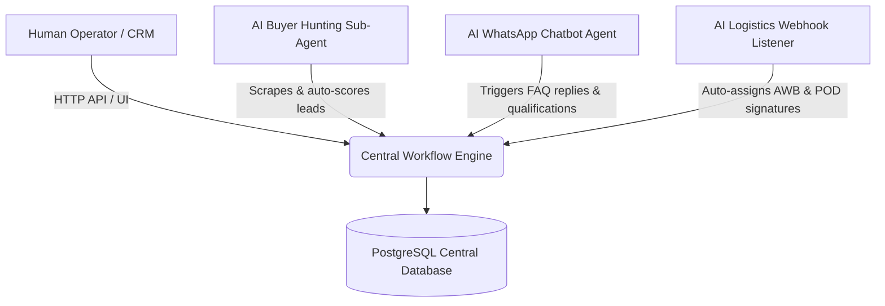

# PRIME APPAREL EXPORTS: Future Scaling & AI Sub-Agent Roadmap

This runbook outlines the architectural vision and progressive engineering stages for scaling the Prime Apparel wholesale operating OS from its current preparation stage into an enterprise-wide automated ecosystem.

---

## 🗺️ 1. Multi-Agent Orchestrations

The workflow engine and RBAC boundaries are designed to support **both human staff and autonomous AI sub-agents**.

In the next phase, autonomous AI specialists will inherit roles:
- **`AI_BUYER_HUNTER`**: Connects local market scrapers to `/api/admin/workflow` to insert cold leads, auto-calculate lead scores, and trigger outreach notifications.
- **`AI_CHATBOT_BOT`**: Listens to WhatsApp incoming webhooks, queries the FAQ confidence database, and drafts automated replies.
- **`AI_LOGISTICS_BOT`**: Integrates with Shiprocket APIs to auto-register parcels, assign tracking numbers, and mock tracking webhooks.

---

## 📞 2. WhatsApp Business API Automation Hooks

The `whatsAppLog` table and standard auto-reply brain (`src/lib/whatsapp.ts`) can scale into a **real-time WhatsApp Business Cloud API integration**:

1.  **Configure Webhook Endpoint**:
    Setup a public HTTPS webhook endpoint under `/api/whatsapp/webhook` to handle Facebook verification handshakes and WhatsApp payload deliveries.
2.  **Attach Dynamic FAQ Dispatcher**:
    When a customer asks a question:
    - Route text to `queryFAQBrain(message)`.
    - If confidence > 70%, trigger automated Cloud API response instantly.
    - If confidence < 70%, write an unhandled notification to the `SALES` department and log it in the dashboard inbox for manual reply!

---

## 📈 3. CRM and Analytics Expansion

As database entries grow under PostgreSQL connections, scale analytical capabilities using these strategies:

1.  **Integrate Transaction Pooling (`pgbouncer`)**:
    Ensure serverless Next.js functions use pooled database endpoints (e.g. Neon transactional ports) to prevent exhausting database connection parameters during concurrent analytical reads.
2.  **Add Product Demand Analytics**:
    Introduce database aggregations to compile order trends, category demands (kurti, suit, festive, daily), and fabric popularity indexes, allowing the `PURCHASE` and `PRICING` teams to pre-order top fabric mills before stockouts occur.
3.  **Audit Logs Ledger Analysis**:
    Perform time-series audits on the `AuditLog` table to calculate average handoff times (e.g. from `STOCK_ENTRY` to `QC` to `PRICING` complete) to optimize company bottlenecks.
